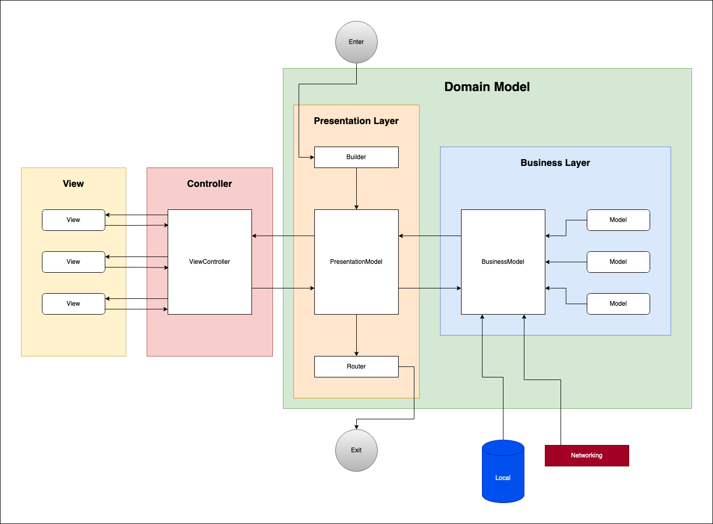

# MovieListing
Movie Listing App demo with MVC

I used an MVC template which I made. You can inspect [here](https://github.com/gkoca/MVCTemplate)

You can see the basic scene architechture from following diagram.
## Architecture

## INFO
- Used Swift 5.3.2
- Used Xcode 12.4.0 RC as IDE
- Did not changed deployment target. (stays 14.3)
- **Did not used any 3rd party framework**
